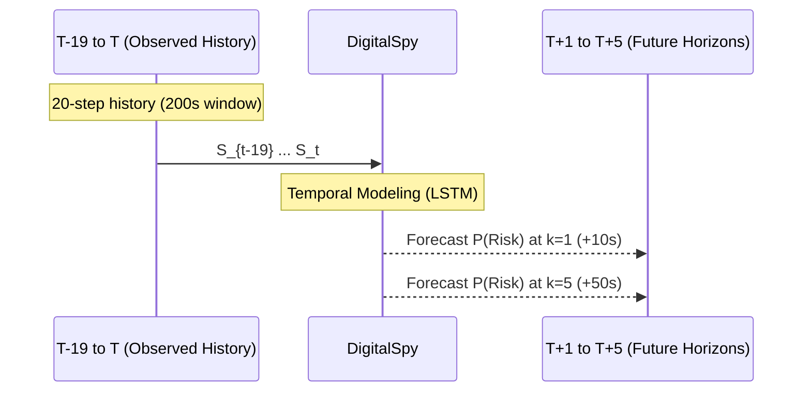
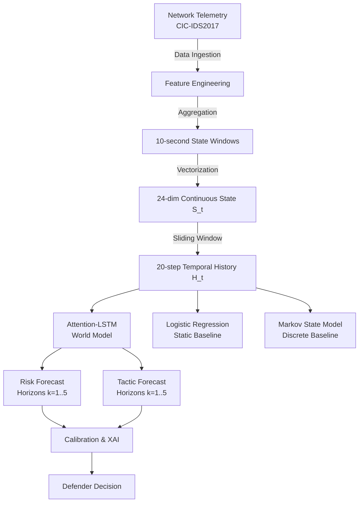
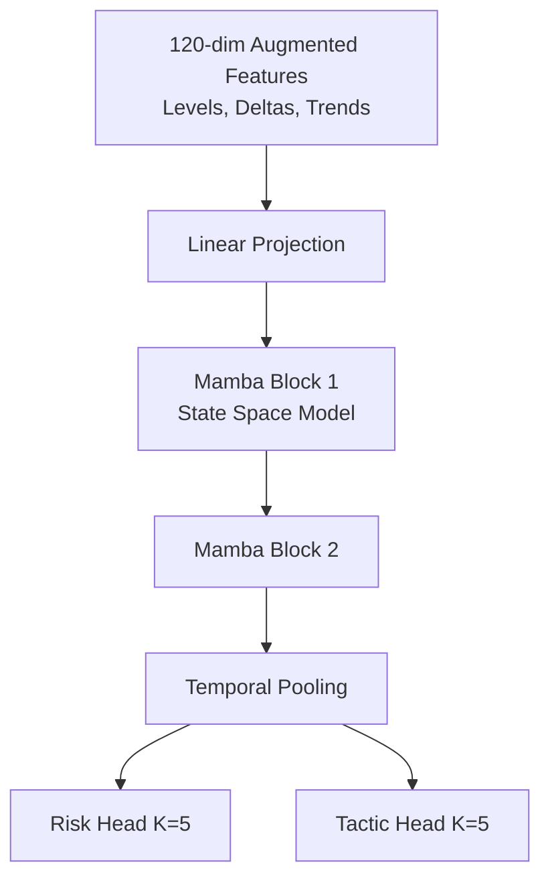

# DigitalSpy — Full Research Narrative

## AI-Based Network Attack Forecasting from Network Traffic Data for NTRO

### Abstract

DigitalSpy is a research prototype for **AI-based forecasting of malicious network behaviour from network traffic telemetry**, developed in response to the NTRO problem statement on proactive cyber defence. The system is designed around a world-model-inspired pipeline in which observed network traffic is transformed into a temporal network state, the evolution of that state is modelled, and future attack risk is forecast over multiple horizons.

The experimental programme deliberately progressed from simple baselines toward temporal modelling rather than beginning with a complex neural architecture. The evaluation therefore covers static logistic-regression detection, a discrete Markov state-transition model, an attention-based LSTM for multi-horizon forecasting, controlled threshold analysis, pre-attack feature analysis, and an augmented temporal-feature LSTM. The experiments show a clear positive result for **one-step future-risk prediction**, where the Attention-LSTM achieved a Macro-F1 of **0.8368 versus 0.7761 for the logistic-regression forecasting baseline, an improvement of 6.07 percentage points**. 

At the same time, the experiments demonstrate that high predictive performance at future-risk classification does not automatically translate into reliable proactive early warning. The Phase 7 experiments found that lower decision thresholds increase proactive detection and that measurable pre-attack feature differences exist, particularly in inter-arrival-time behaviour, but the current LSTM does not consistently convert those signals into early forecasts. The work therefore establishes a measurable temporal forecasting capability while clearly identifying the remaining challenge of achieving robust forecast lead time.

---

# 1. Problem Motivation

Traditional network intrusion systems primarily answer the question:

> **“Is malicious activity happening now?”**

DigitalSpy addresses a different question:

> **“Given the network behaviour observed so far, how likely is malicious activity to occur in the near future?”**

This distinction is central to the NTRO problem. Detection alone can identify an attack after evidence has become observable, whereas forecasting attempts to provide defenders with an opportunity to prepare before the next malicious state occurs.

The DigitalSpy research therefore treats network telemetry as a partially observed dynamic process:

$$
O_t \rightarrow S_t
$$

where \(O_t\) represents observed traffic/telemetry and \(S_t\) is a structured network state. The temporal model then attempts to estimate:

$$
P(S_{t+1}|S_t)
$$

and more generally future risk conditioned on a recent history:

$$
P(Y_{t+k}|S_{t-h+1:t})
$$

The implementation uses a 20-window history, with each window representing 10 seconds, and forecasts five future horizons, corresponding to 10–50 seconds ahead. The resulting sequence representation is therefore:

$$
H_t=(S_{t-19},...,S_t)
$$

with:

$$
K=5
$$

and a 50-second maximum forecast horizon. The final processed pipeline contains 24 state features per timestep, 20-step histories, and five-step future targets.


### Temporal Forecasting Concept

 

---

# 2. Dataset and Experimental Foundation

The primary benchmark was **CIC-IDS2017**. The dataset audit identified eight CSV traffic files containing the benchmark's benign and attack scenarios. The audited files include Monday benign traffic, Tuesday FTP/SSH Patator attacks, Wednesday DoS attacks and Heartbleed, Thursday web attacks and infiltration, and Friday Bot, PortScan and DDoS traffic.     

The experiment intentionally preserved whole scenario/file blocks instead of using a random row-level split. The audited split was:

**Training:** Monday, Tuesday, Wednesday
**Validation:** Thursday WebAttacks and Thursday Infiltration
**Test:** Friday Morning, Friday DDoS and Friday PortScan. 

This design preserved temporal/scenario separation but exposed an important characteristic of CIC-IDS2017: the attack classes are highly concentrated by scenario.

---

# 3. Network State Representation

Each 10-second state window is represented by 24 engineered features covering:

* traffic volume and timing,
* TCP flag behaviour,
* inter-arrival time statistics,
* packet-size statistics,
* source/destination diversity,
* bidirectional behaviour,
* packet-derived characteristics.

The state representation was deliberately kept compact so that the Week-1 system could remain computationally tractable while still combining traffic-flow behaviour with packet-level characteristics.

The final state pipeline produced:

* **107,301 training windows**
* **22,948 validation windows**
* **11,287 test windows**
* **107,277 training sequences**
* **22,924 validation sequences**
* **11,263 test sequences**
* **24 features**
* **20-step temporal history**
* **K=5 forecast horizons**. 

---

# 4. Attack-State Taxonomy

For temporal reasoning, raw attack labels were mapped into six project-level behavioural states:

$$
Z_t\in
\{
BENIGN,
RECON,
INITIAL\_ACCESS,
LATERAL\_MOVEMENT,
C2,
IMPACT
\}
$$

The state label \(Z_t\) is derived from the raw attack labels associated with the window, while the continuous vector \(S_t\) is derived from its traffic features. Thus \(S_t\) and \(Z_t\) are aligned representations of the same network window rather than one being numerically generated from the other.

This taxonomy allowed the research to compare two different temporal modelling approaches:

$$
P(Z_{t+1}|Z_t)
$$

for the Markov model, and:

$$
P(Y_{t+k}|H_t)
$$

for the neural forecasting model.

The mapping from CIC-IDS2017 labels into these six behavioural buckets is a **project-specific engineering taxonomy**, not a claim that CIC-IDS2017 provides native ATT&CK stage labels.

---

# 5. Experiment A — Original Chronological Split

The first complete experiment used the strict scenario split:

```text
Monday–Wednesday → Train
Thursday          → Validation
Friday            → Test
```

This initially appeared attractive because it approximated temporal deployment conditions. However, diagnostic analysis exposed a major limitation.

The resulting state distributions were:

| State            |  Train | Validation |  Test |
| ---------------- | -----: | ---------: | ----: |
| BENIGN           | 73,707 |     21,720 | 4,863 |
| RECON            |  8,298 |          0 |     0 |
| INITIAL_ACCESS   |  5,292 |      1,193 |     0 |
| LATERAL_MOVEMENT |      0 |         35 |     0 |
| C2               |    898 |          0 |     0 |
| IMPACT           | 19,106 |          0 | 6,424 |


The original experiment therefore contained a severe scenario/class mismatch. For example, RECON and C2 appeared in training but not in the test scenario, while other states were absent from training.

The Markov diagnostic further showed that RECON, LATERAL_MOVEMENT and C2 had no observed outgoing transitions in the original training subset, causing Laplace smoothing to dominate those rows. 

The LSTM consequently learned to predict only the classes represented adequately in its training distribution. The diagnostic showed zero predictions for LATERAL_MOVEMENT and essentially no useful recognition for some unseen test classes. 

### Interpretation

Experiment A was therefore retained as a **stress-test/generalisation record**, but it was not accepted as the principal six-class benchmark.

This was an important methodological result: the apparent weakness was primarily caused by **scenario/class support imbalance**, rather than being sufficient evidence that the temporal architecture itself was inadequate.

---

# 6. Experiment B — Corrected Class-Covered Temporal Benchmark

A revised experiment was established to make the supervised risk comparison scientifically meaningful while preserving whole scenario/file blocks and avoiding temporal contamination.

One dataset constraint could not be eliminated: **LATERAL_MOVEMENT was represented by only 36 raw Infiltration samples in the entire CIC-IDS2017 benchmark**, concentrated in a single scenario. Therefore, it was treated as a documented dataset-support limitation rather than artificially replicated or randomly redistributed.

After correction, the training set contained five usable attack-state classes plus benign traffic. The training distribution was:

| State            | Training support |
| ---------------- | ---------------: |
| BENIGN           |           73,707 |
| RECON            |            8,298 |
| INITIAL_ACCESS   |            5,292 |
| C2               |              898 |
| IMPACT           |           19,106 |
| LATERAL_MOVEMENT |                0 |


This experiment became the principal benchmark for evaluating one-step future-risk forecasting.

---

# 7. Baseline 1 — Logistic Regression

Two logistic-regression baselines were maintained.

The first measured current-risk classification. The second was the **fair forecasting baseline**:

$$
LR(S_t)\rightarrow Y_{t+1}
$$

The latter is important because comparing current detection \(Y_t\) against future forecasting \(Y_{t+1}\) would be methodologically unfair.

The Experiment B one-step LR baseline achieved:

$$
Macro\text{-}F1=0.7761
$$

with:

* Precision = 0.8687
* Recall = 0.7696
* FPR = 0.4589. 

The corresponding current-risk experiment achieved Macro-F1 = 0.7854. 

The small difference between current classification and one-step forecasting establishes the static baseline against which temporal context can be evaluated.

---

# 8. Baseline 2 — Markov World Model

The second baseline implemented the simplest explicit temporal dynamics model:

$$
P(Z_{t+1}|Z_t)
$$

The six-state transition matrix was used to derive multi-step forecasts through:

$$
p_{t+k}=p_tP^k
$$

After the Experiment B split correction, the Markov matrix contained substantial empirical support for several states.

For example:

* RECON → RECON: 8,186 observed transitions
* IMPACT → IMPACT: 16,779 observed transitions
* C2 had 898 outgoing transitions
* INITIAL_ACCESS had 5,292 outgoing transitions. 

The model therefore moved beyond the earlier Laplace-dominated behaviour.

However, the final test scenario was overwhelmingly composed of BENIGN and IMPACT states, meaning persistent IMPACT behaviour was extremely easy to predict. The resulting Markov tactic scores remained approximately 0.996 across the five horizons. 

### Interpretation

This result demonstrates that **simple state persistence can be highly predictive in a persistent attack scenario**, but it should not be interpreted as proof that the Markov model is generally superior to a neural world model.

It is better described as a **scenario-specific persistence baseline**.

---

# 9. Attention-LSTM World Model

The principal neural model used a one-layer LSTM with hidden size 64 and additive temporal attention over the 20-step history.

Conceptually:

$$
X_{t-19:t}
\rightarrow
LSTM
\rightarrow
Attention
\rightarrow
Risk\ Head + Tactic\ Head
$$

The two output heads forecast five future horizons:

### Risk head

$$
P(Y_{t+k}^{risk}=1|H_t)
$$

### Tactic head

$$
P(Y_{t+k}^{tactic}|H_t)
$$

The model therefore attempted direct multi-horizon prediction instead of recursively feeding its own predictions back into itself.

---

# 10. First LSTM Experiment

The first LSTM training run produced a k=1 risk Macro-F1 of **0.6166**, compared with the original LR baseline of 0.6017, for a gain of only 1.49 percentage points.

The result did not meet the predefined Criterion 1 requirement of at least +5 percentage points.

The validation curve showed immediate generalisation deterioration. Training loss fell from approximately 0.86 to 0.43 while validation loss increased from approximately 3.74 and remained substantially higher throughout training. The best validation checkpoint was epoch 1. 

At this point, the project deliberately **did not immediately hyperparameter-tune the model**. Instead, the experiment was investigated as a data/split problem first.

That decision led to Experiment B.

---

# 11. Experiment B — Attention-LSTM Result

After correcting the experimental split, the Attention-LSTM produced:

$$
Macro\text{-}F1_{LSTM,k=1}=0.8368
$$

against:

$$
Macro\text{-}F1_{LR,k=1}=0.7761
$$

Therefore:

$$
\Delta F1=0.8368-0.7761
$$

$$
\boxed{\Delta F1=+6.07\ percentage\ points}
$$

The predefined success criterion was:

$$
\Delta F1\ge5pp
$$

so:

$$
\boxed{Criterion\ 1=PASS}
$$

This is the strongest validated quantitative result in the current project. 

### Interpretation

The experiment provides evidence that:

> **A 20-window temporal representation can improve one-step future-risk prediction over a static feature-based logistic-regression forecasting model.**

This directly supports the core temporal-modelling hypothesis of DigitalSpy.

However, it should **not** be generalized into a claim that the model is already a reliable long-horizon proactive predictor.

---

# 12. Multi-Horizon Forecasting

The LSTM risk forecast remained relatively stable over the five horizons:

| Horizon | Risk Macro-F1 |
| ------- | ------------: |
| k=1     |        0.8368 |
| k=2     |        0.8357 |
| k=3     |        0.8358 |
| k=4     |        0.8417 |
| k=5     |        0.8347 |

The average risk F1 across the five horizons was approximately:

$$
F1_K=0.837
$$

The tactic forecasts, by contrast, remained much weaker:

| Horizon | Tactic Macro-F1 |
| ------- | --------------: |
| k=1     |          0.2812 |
| k=2     |          0.2748 |
| k=3     |          0.2788 |
| k=4     |          0.2793 |
| k=5     |          0.2726 |

with:

$$
F1_K=0.2773
$$


This highlights an important distinction:

> **Binary future-risk prediction is substantially easier than reliable multi-class prediction of the precise future attack state.**

---

# 13. Criterion 2 — LSTM versus Markov

The predefined second criterion asked the LSTM to outperform the Markov model in six-class tactic forecasting.

The measured result was:

$$
F1_K^{Markov}=0.9922
$$

versus:

$$
F1_K^{LSTM}=0.2773
$$

so the numerical difference was:

$$
-71.49pp
$$

and the criterion was not passed. 

However, the context of the test scenario makes this comparison **scenario-limited**.

The test state distribution contains only:

* BENIGN = 4,863
* IMPACT = 6,424

with no RECON, INITIAL_ACCESS, LATERAL_MOVEMENT or C2 samples. 

The Markov model benefits from strong IMPACT persistence:

$$
P(IMPACT\rightarrow IMPACT)
$$

with 16,779 observed IMPACT self-transitions. 

Therefore the 0.9922 Markov score primarily demonstrates that **persistent DDoS/IMPACT behaviour is easy to extrapolate**, not that the Markov model has demonstrated superior general six-class world modelling.

Criterion 2 is consequently retained as:

> **Not demonstrated under a representative multi-class test scenario.**

---

# 14. Calibration Analysis

Probability quality was also measured rather than relying solely on F1.

For k=1:

$$
Brier=0.1147
$$

and:

$$
ECE=0.1178
$$

The Brier score is a probabilistic error measure where lower is better, while ECE measures calibration mismatch. 

The result indicates that the model probabilities contain useful information but are not perfectly calibrated.

This matters operationally because DigitalSpy should treat risk scores as **probabilistic estimates rather than guarantees**.

---

# 15. Criterion 3 — Forecast Lead Time

The original lead-time test used a threshold of:

$$
0.90
$$

with the threshold selected from validation rather than the test set.

The initial final evaluation found:

* total attack sequences = 6,512
* median lead time = 0 seconds
* positive lead-time count = 13
* positive lead-time rate = 0.2%. 

This means that under the strict 0.90 operating point, the system primarily behaved as an **attack detector rather than a proactive predictor**.

Criterion 3 therefore failed its predefined requirement.

This was not treated as a reason to hide the result. Instead, it motivated a dedicated investigation into whether the threshold, feature representation, or forecasting objective was responsible.

---

# 16. Phase 7.1 — Threshold Sensitivity

The next experiment introduced a proper validation split into **Val-A and Val-B**, separating threshold selection from proactive evaluation.

The threshold sensitivity analysis showed:

| Threshold | Proactive Detection Rate | Median Lead |
| --------- | -----------------------: | ----------: |
| 0.30      |                    20.0% |       +25 s |
| 0.50      |                    18.3% |       +30 s |
| 0.90      |                     6.7% |       +25 s |

The most important observation was not simply the improvement in percentage points.

It was that:

> **The model was capable of producing earlier warnings at lower operating thresholds, but its earlier signal was too weak to cross a very conservative 0.90 threshold consistently.**

The 0.30 threshold produced approximately three times as many proactive detections as the 0.90 threshold.

However, the threshold was not simply changed to 0.30 and declared optimal. The experiment deliberately treated threshold selection as an operating-point problem involving:

$$
PDR,\ Precision,\ Recall,\ FPR,\ LeadTime
$$

rather than maximizing alert volume alone.

---

# 17. Phase 7.2/7.3 — Pre-Attack Feature Analysis

The next investigation asked a deeper question:

> **Does the traffic history actually contain measurable differences before an attack?**

This was answered by comparing sequences where:

$$
Current=BENIGN
$$

but:

$$
Future=ATTACK
$$

against sequences that remain benign.

The analysis found several statistically meaningful differences.

The strongest feature was:

$$
std\_iat,\quad Cohen's\ d=0.75
$$

followed by:

$$
max\_iat,\quad d=0.60
$$

and:

$$
mean\_iat,\quad d=0.42
$$

Other discriminative features included PSH ratio, packets/sec and destination-IP diversity.

### Interpretation

This means:

> **The feature space contains measurable pre-attack distributional differences.**

The most important signal family was **inter-arrival-time behaviour**, suggesting that traffic timing irregularity may contain information that appears before some attacks become explicitly observable.

---

# 18. Critical Finding — Statistical Signal versus Learned Signal

The feature analysis did not automatically mean that the LSTM had learned the precursor relationship.

In fact, the LSTM showed the opposite behaviour in the analysed populations:

$$
Mean(P_{risk}|preattack)=0.0761
$$

while:

$$
Mean(P_{risk}|pure-benign)=0.2255
$$

The pure-benign sequences therefore received **higher average predicted risk** than the actual pre-attack sequences.

This led to an important research distinction:

> **A feature can statistically discriminate two populations without the current forecasting model learning the correct predictive relationship.**

This became one of the most important findings in the DigitalSpy experiment.

---

# 19. Phase 7 Controlled Progression Experiment

A dedicated controlled forecasting experiment was then constructed using **1,281 validation sequences** in which the current state was benign but future horizons contained an attack.

The goal was specifically to measure:

$$
Attack\ onset - First\ forecast
$$

rather than ordinary classification performance.

Under the strict 0.90 threshold, the original controlled experiment produced only 13 proactive detections.

A refined analysis established the following structure:

```text
PROACTIVE       forecast before onset
AT ONSET        forecast coincides with onset
REACTIVE        forecast after onset
MISSED          no qualifying forecast
```

This is more scientifically meaningful than assigning an artificial negative lead time to an attack that was never forecast.

The Phase 7 controlled progression experiment recorded:

* 1,281 eligible proactive sequences
* 13 proactive detections in the strict threshold evaluation
* median positive-only lead time = 20 seconds
* strong degradation as the forecast horizon increased. 

The result established that some early-warning capability exists, but it is **not yet reliable enough to claim robust proactive forecasting**.

---

# 20. Phase 7.4 — Temporal Trend Feature Augmentation

The final experiment in the current research cycle asked:

> **Could explicit modelling of feature trajectories improve pre-attack forecasting?**

The original 24-feature vector was extended to 120 features by adding:

$$
x_t
$$

$$
\Delta x_t=x_t-x_{t-1}
$$

$$
\Delta^2x_t=\Delta x_t-\Delta x_{t-1}
$$

rolling standard deviation, and rolling maximum.

The augmented representation therefore attempted to expose:

* current feature levels,
* rate of change,
* acceleration,
* volatility,
* recent extrema.

The purpose was to make latent trajectories explicit instead of asking the LSTM to discover them solely from the sequence history.

---

# 21. Phase 7.4 Result

The expanded 120-feature representation produced essentially the same proactive performance as the simpler delta-based experiment:

* **PDR = 21.7%**
* **Median proactive lead = +30 seconds**
* Best epoch = 1

The additional feature families therefore produced **no material improvement in proactive forecasting**.

This is a useful negative result because it rules out one simple hypothesis:

> “The LSTM fails only because it cannot see feature trajectories.”

The experiments suggest that simply expanding the feature vector with increasingly explicit temporal derivatives does not solve the problem.

---

# 22. Overfitting and Generalisation Behaviour

Across the LSTM experiments, a persistent pattern appeared:

$$
Training\ loss\downarrow
$$

while:

$$
Validation\ loss\uparrow
$$

after the earliest epoch.

The recorded final LSTM validation curve shows training loss decreasing consistently while validation loss rises and the best checkpoint remains epoch 1. 

The interpretation should **not** be “the LSTM architecture is proven incapable.”

A more defensible conclusion is:

> The current LSTM configuration and forecasting objective exhibit poor generalisation under the available scenario distributions, and additional hand-engineered temporal features do not materially resolve that limitation.

This leaves open three directions:

1. model regularisation/optimisation,
2. a forecasting-specific training objective,
3. a stronger temporal/world-model architecture.

---

# 23. Overall Experimental Findings

The complete evidence can be summarized as follows.

| Research Question                                                        | Finding                     |
| ------------------------------------------------------------------------ | --------------------------- |
| Does temporal context improve future-risk prediction?                    | **Yes**                     |
| LSTM vs LR one-step risk                                                 | **+6.07pp**                 |
| Does simple state persistence contain predictive information?            | **Yes**                     |
| Markov vs LSTM six-class tactic forecasting                              | **Scenario-limited**        |
| Does the feature space contain pre-attack signal?                        | **Yes**                     |
| Does the current LSTM reliably exploit that precursor signal?            | **Not yet**                 |
| Does lowering the threshold increase proactive alerts?                   | **Yes**                     |
| Does explicit delta/trend feature expansion solve proactive forecasting? | **No material improvement** |
| Robust 20–50s proactive forecasting demonstrated?                        | **No**                      |

The principal quantitative evidence for temporal modelling is the Experiment B comparison:

$$
LR=0.7761
$$

versus:

$$
LSTM=0.8368
$$

yielding:

$$
\boxed{+6.07pp}
$$

and satisfying the predefined Criterion 1 threshold. 

---

# 24. Scientific Interpretation

The current evidence supports a layered conclusion.

### First

**Temporal history matters.**

The Attention-LSTM outperformed a static one-step logistic-regression forecasting baseline by 6.07 percentage points. This provides empirical support for using sequential state history rather than relying exclusively on the current traffic window.

### Second

**Simple dynamics matter too.**

The Markov model demonstrates that some attack behaviour is strongly state-persistent. This suggests that future network state prediction should account explicitly for temporal dynamics rather than treating each observation independently.

### Third

**Detection performance and forecasting capability are different objectives.**

A model may predict future attack risk with good classification F1 while still producing little or no lead time. The current experiment demonstrates exactly this distinction.

### Fourth

**The dataset contains precursor information, but the current model does not exploit it reliably.**

The statistical analysis of IAT and related features indicates that pre-attack and pure-benign histories are not identical. However, the current model's probabilities do not consistently rank pre-attack histories above pure-benign histories.

### Fifth

**More feature engineering alone does not solve the problem.**

The 120-feature trajectory representation produced almost the same proactive performance as the simpler delta formulation.

Therefore the likely next improvement is not another large increase in handcrafted feature count.

---

# 25. Dataset Limitations

Several limitations are important when interpreting the results.

### Scenario concentration

CIC-IDS2017 was designed as a benchmark dataset rather than as a complete representation of modern critical-infrastructure networks. Attack behaviours occur in highly concentrated scenario blocks.

This creates extreme train/validation/test distribution differences, particularly for tactic-level evaluation.

### LATERAL_MOVEMENT support

LATERAL_MOVEMENT is represented by only 36 Infiltration samples in the entire dataset and therefore cannot be distributed meaningfully across train, validation and test without violating the scenario structure.

It is consequently treated as a dataset limitation rather than a failed prediction class.

### Source-IP identity

The system uses source IP as the host identity assumption. In production enterprise environments, NAT, DHCP and shared addressing can violate this simplification.

### PCAP availability

The current dataset audit artifact records that no separate PCAP files were available for the audited CSV inputs and therefore packet-derived features were configured for training-period imputation. 

This should remain explicitly documented in the final technical report until actual PCAP-backed packet feature coverage is demonstrated.

---

# 26. Security and Operational Interpretation

DigitalSpy is not intended to autonomously execute defensive actions.

Its intended role is:

```text
Network telemetry
       ↓
State estimation
       ↓
Temporal modelling
       ↓
Future risk probability
       ↓
Likely attack behaviour
       ↓
Evidence / explanation
       ↓
Defender decision
```

The numerical forecast should remain model-generated. Any later language-model agent is an orchestration and explanation layer rather than the source of numerical truth.

This separation is important for an operational cybersecurity system because probabilistic forecasts should remain auditable.

---

# 27. Current System Architecture

The research prototype currently follows:



The architecture is intentionally modular so that stronger temporal models can replace or augment the current LSTM in subsequent research.

---

# 28. Current Research Status

The project should currently be described as:

> **A validated research prototype demonstrating improved one-step future-risk prediction using temporal network-state modelling, while identifying proactive multi-horizon forecasting and reliable lead time as unresolved research challenges.**

It should **not** currently be described as:

> “A fully solved attack forecasting system.”

The difference is important.

DigitalSpy has demonstrated:

$$
\boxed{\text{Temporal forecasting improves one-step risk prediction}}
$$

but has not yet demonstrated:

$$
\boxed{\text{reliable proactive 20–50 second attack warning across representative scenarios}}
$$

---

# 29. Final Experimental Ledger

```text
DIGITALSPY — EXPERIMENT LEDGER

Experiment A
Original chronological scenario split
→ Archived
→ Exposed major class-support mismatch

Experiment B
Class-covered temporal benchmark
→ Primary benchmark

LR one-step risk
Macro-F1 = 0.7761

Attention-LSTM k=1
Macro-F1 = 0.8368

Improvement
+6.07pp
Criterion 1 = PASS ✅

Markov tactic F1_K
= 0.9922

LSTM tactic F1_K
= 0.2773

Criterion 2
Scenario-limited ⚠️

Calibration
Brier = 0.1147
ECE = 0.1178

Original Lead-Time Evaluation
Median = 0.0s
Positive rate = 0.2%
Criterion 3 = FAIL ❌

Controlled Phase 7
1,281 BENIGN→ATTACK sequences

Threshold sensitivity
0.30 → 20.0% PDR
0.50 → 18.3% PDR
0.90 → 6.7% PDR

Successful proactive alerts
Median lead ≈ +20–30s

Phase 7.4
120 temporal features
PDR = 21.7%
Median proactive lead = +30s
No material improvement

LATERAL_MOVEMENT
36 samples total
Dataset limitation ⚠️
```

The underlying Phase 7 report records 1,281 eligible progression sequences and a 21.7% proactive detection result for the augmented experiment. 

---

# 30. Phase 8 — Future Architecture Roadmap (Mamba)

Given the empirical ceiling reached in Phase 7—where explicit trajectory features (120-dimensional temporal inputs) failed to materially improve the 21.7% Proactive Detection Rate—the research indicates that the standard LSTM architecture cannot extract the weak, sparse pre-attack signals without rapidly overfitting to the dominant classes (demonstrated by the best validation checkpoint consistently remaining at Epoch 1).

The planned Phase 8 architecture will therefore transition from an LSTM to a **Mamba (State Space Model)**. Mamba is specifically designed for continuous sequence modelling and capturing long-range dependencies without the vanishing memory issues of LSTMs or the quadratic computational complexity of Transformers. This will allow the temporal world model to better distinguish the subtle timing irregularities (such as the statistically significant `std_iat` signal) from pure-benign noise, providing the architectural capability needed to unlock robust multi-horizon forecasting.

### Proposed Mamba Architecture



---


---

# 31. Engineering & Implementation Pipeline (How it is built)

DigitalSpy's codebase is designed for rigorous scientific experimentation and modular extensibility.

### 1. Data Engineering (`src/digitalspy/features/`)
- **Raw Ingestion:** Reads flow-level data from CIC-IDS2017 CSVs.
- **Aggregation:** Groups flows by `Source IP` into 10-second temporal windows.
- **Feature Extraction:** Computes 24 continuous features (levels) capturing volume, TCP flags, and inter-arrival times (IAT).
- **Augmentation (Phase 7.4):** Expands the 24 features to 120 by computing step-to-step deltas, acceleration, rolling standard deviation, and rolling maximums to capture attack *trajectories*.

### 2. State Representation (`src/digitalspy/pipeline/`)
- **Sequencing:** Uses a sliding window to generate `(Batch, 20, 120)` tensors representing $H_t$.
- **Target Generation:** Constructs future targets $Y_{t+1} ... Y_{t+5}$ by looking ahead 10-50 seconds.
- **Handling Sparsity:** Uses chronological scenario-based splitting to prevent data leakage while maintaining the integrity of attack progressions.

### 3. Model Architecture (`src/digitalspy/models/`)
- **Attention-LSTM:** A PyTorch-based recurrent model featuring:
  - 1-layer LSTM (hidden size 64).
  - Additive temporal attention to weigh historical importance.
  - Multi-task output heads: Binary Risk and 6-class Tactic classification.
- **Baselines:** Scikit-learn Logistic Regression for static benchmarking, and a custom NumPy-based Markov Transition Matrix for discrete persistence modelling.

### 4. Evaluation Harness (`scripts/evaluate*.py`)
- **Proactive Metrics:** Instead of standard F1, the harness computes exact **Lead Time** by comparing the timestamp of the first alert against the ground-truth onset of the attack.
- **Threshold Calibration:** Splits validation data into `Val-A` (for finding the optimal threshold) and `Val-B` (for unbiased proactive evaluation).


---

# 32. Conclusion

DigitalSpy's experimental programme provides a clear and reproducible progression from static detection toward predictive cyber defence.

The most significant positive result is that **temporal state modelling improves one-step future-risk prediction**: the Attention-LSTM achieved a Macro-F1 of **0.8368 compared with 0.7761 for the logistic-regression forecasting baseline**, exceeding the predefined improvement requirement by 6.07 percentage points. 

The work also demonstrates why attack forecasting is substantially harder than ordinary intrusion detection. The Markov model performs exceptionally on the persistent DDoS/IMPACT test scenario, while the LSTM's six-class tactic performance remains weak under that scenario distribution. The test scenario composition therefore prevents a broad claim of six-class world-model superiority. 

Most importantly, the Phase 7 investigation reveals that **pre-attack information is not entirely absent**. Inter-arrival-time and related traffic-behaviour features show measurable differences before attacks. However, the current LSTM does not consistently transform those differences into reliable early-warning probabilities. Lower thresholds recover some proactive alerts, but explicit expansion from 24 to 120 temporal features produces little additional gain.

Consequently, the current DigitalSpy system should be viewed as a **validated temporal forecasting foundation rather than a finished predictive defence platform**.

The next research step shifts from “add more handcrafted features” to a stronger state-space world-model architecture (Mamba), alongside more targeted investigations of forecast-specific objectives and scenario-balanced evaluation.

The central research lesson from the current work is:

$$
\boxed{
\text{Good attack classification}
\neq
\text{good attack forecasting}
}
$$

and:

$$
\boxed{
\text{Finding precursor signal}
\neq
\text{learning reliable precursor prediction}
}
$$

Those distinctions now provide the foundation for the next generation of DigitalSpy.

---

### Evidence base used

This narrative is grounded in the uploaded experimental artifacts covering the dataset audit, state pipeline, baseline metrics, diagnostics, LSTM metrics and validation curves, Markov evaluation, final evaluation, lead-time analysis, and Phase 7 progression results.        
